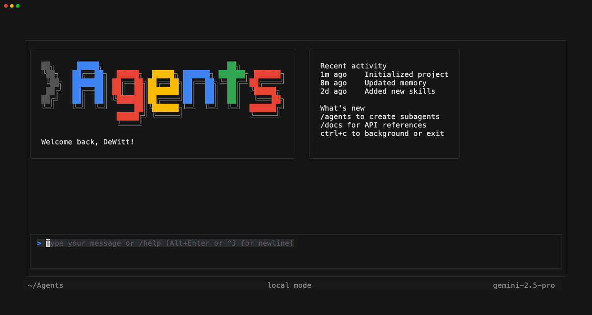
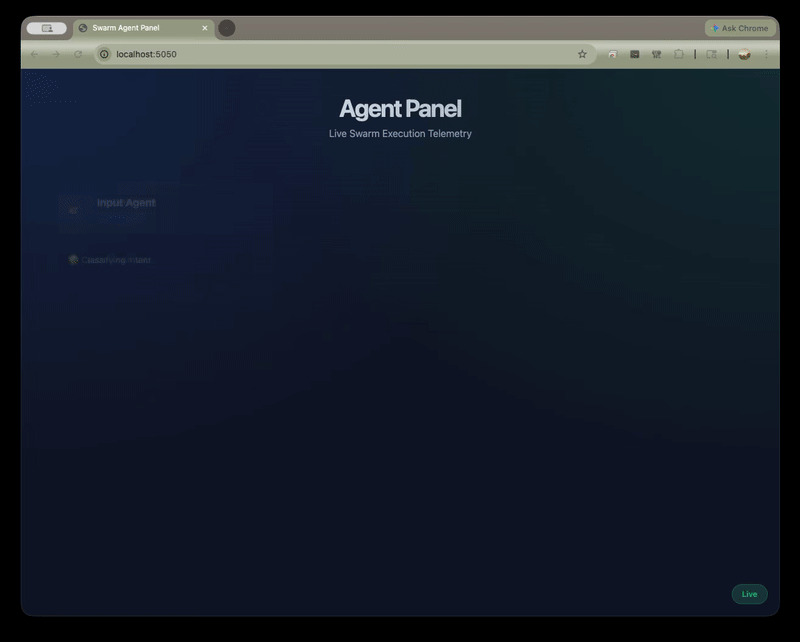

# Swarm CLI

A clean CLI and embeddable SDK for massively multi-agent orchestration and
observability into native ecosystems.



## Features

- **Terminal UI**: Persistent, interactive terminal sessions built on Bubble
  Tea, featuring rich native markdown rendering (`glamour`), async execution,
  client-side slash commands (`/help`, `/model list`, `/skills`), multi-pane
  layouts, real-time agent handoff visualization, and flattened multiline
  history for stable autocomplete.

- **Agent Panel**: The UI shifts from a basic chat REPL into an agent-centric
  layout when swarms are deployed. It visualizes concurrent agents working in
  parallel via live "Agent Cards" featuring **Live Telemetry** (e.g.,
  real-time scrolling build logs and test outputs) and dynamic status updates.

- **Semantic Codebase Awareness**: Native integration with **Language Server
  Protocol (LSP)** and **Tree-sitter**. Swarm agents perform deterministic,
  type-aware code navigation (Go-to-Definition, Find References) and fast
  structural parsing rather than relying on noisy text searches.

- **Specialized Reviewers**: Invoke hyper-focused agent personas for rigorous
  audits. Type `@code_review` for architectural analysis, `@ux_review` for
  friction hunting, or `@quality_review` for agentic performance evaluation.

- **Sysadmin & Environment Remediation**: A dedicated `sysadmin` agent
  autonomously diagnoses host operating systems and safely resolves missing
  dependencies (via Homebrew, APT, npm, etc.) so other agents can succeed
  without manual intervention.

- **Direct Shell Execution (`!`)**: Toggle into a dedicated shell mode or run
  single-shot bash commands instantly from within the REPL without breaking
  your flow.

- **Context Referencing (`@`)**: Seamlessly inject files directly into the
  LLM's context window by typing `@` to trigger an inline, fuzzy-filtered
  overlay of your workspace files.

- **Input Agent**: A high-speed, lightweight routing layer that pre-processes
  every user input. It proactively detects digressions and context shifts,
  rerouting the conversation to the Swarm Agent _before_ the message is
  processed, ensuring the system stays aligned with human topic-switching.

- **Session Persistence & Resumption**: Sessions are automatically persisted
  to a local SQLite database. View past activity with `/sessions`, rewind the
  conversation history with `/rewind`, and easily pick up where you left off
  using the `--resume` flag.

- **4-Tier Hierarchical Memory**: Swarm implements a robust, OS-inspired
  memory architecture to prevent context rot during long-horizon tasks.

  - *Working Memory*: The immediate token window, automatically pruned of
    massive tool outputs.
  - *Episodic Memory*: The chronological audit log of the active session.
  - *Semantic Memory*: An embedded SQLite/FTS5 database that passively
    extracts "timeless facts" (e.g., project build commands, API keys) during
    execution and automatically injects them into future prompts. Use
    `/forget` to purge hallucinated or outdated facts.
  - *Global Memory*: Cross-project preferences set via `/remember` or
    `.swarm/SWARM.md` files.

- **Async Execution & Input Queueing**: The CLI operates asynchronously. You
  are never locked out while agents are working. You can queue up multiple
  instructions or seamlessly interrupt (`Ctrl+C` or `Esc`) a runaway agent
  mid-thought without crashing the session.

- **Observe Mode**: Toggle deep ADK telemetry via `^O` to view thoughts, tool
  args, and tool results in a dedicated UI pane, giving you full visibility
  into the agent's internal reasoning.

- **Read-Only Plan Mode**: Use the `/plan` command or `--plan` flag to safely
  brainstorm architecture with the agent explicitly sandboxed from modifying
  your filesystem.

- **Web Fetch & Search**: Native capabilities to search the web and fetch
  up-to-date documentation during task execution using the `web_researcher`
  agent.

- **UNIX Piping**: Integrate agents directly into your workflows via
  single-shot prompts and standard input (e.g.,
  `cat error.log | swarm -p "What went wrong?"`). You can output raw JSON
  execution traces using `--trajectory` or a human-readable execution summary
  using `--explain`.

- **Dynamic Skills Architecture**: Completely decoupled capabilities adhering
  to the open `agentskills.io` standard (`SKILL.md`). Easily write, share, and
  dynamically load new skills without recompiling.

- **Framework Agnostic**: Natively supports Google ADK, LangGraph, and custom
  architectures via `agent.yaml` manifests.

- **Agent Swarms**: The core SDK is powered by the Google Agent Development
  Kit (ADK) and orchestrates a swarm of specialized internal agents using a
  cascading model architecture (fast models for routing, reasoning models for
  execution).

## Installation

### Using Go

If you have Go installed, you can install the `swarm` CLI directly:

```bash
go install github.com/dewitt/swarm/cmd/swarm@latest
```

Ensure your `GOBIN` directory (typically `~/go/bin`) is in your system's
`PATH`.

### From Source

To build and install from source:

```bash
# Clone the repository
git clone https://github.com/dewitt/swarm.git
cd swarm

# Install the binary (Standard)
go install ./cmd/swarm

# Install with FTS5 Semantic Search support (Recommended)
go install -tags fts5 ./cmd/swarm
```

## Getting Started

### 1. Set your API Key

Swarm requires an active Google AI (Gemini) API key. You can get one from
[https://aistudio.google.dev/app/apikey](https://aistudio.google.dev/app/apikey).

```bash
export GOOGLE_API_KEY="your-api-key-here"
```

### 2. Launch the CLI

Simply running `swarm` launches the full-screen interactive Terminal User
Interface (TUI):

```bash
swarm
```

### 3. Change Models

To change the active LLM provider, use the `/model` command:

```bash
# Select auto-mode (default)
/model auto

# List all available models and select interactively
/model list
```

## Web Agent Panel

Swarm includes a built-in web server that broadcasts live agent telemetry via
Server-Sent Events (SSE). While running the CLI, you can open your browser to
**[http://localhost:5050](http://localhost:5050)** to view a rich, graphical
dashboard of all active agents in your swarm, complete with live status
indicators and real-time execution logs.



## E2E Evaluations (LLM-as-a-Judge)


### Evaluation Philosophy

We believe that autonomous agents cannot be effectively validated using
traditional, brittle unit testing due to the non-deterministic nature of LLMs.
Instead, Swarm embraces a **Zero-HITL, LLM-as-a-Judge** philosophy for
continuous integration.

Our native end-to-end evaluation harness spins up sandboxed, ephemeral
workspaces, issues high-level natural language directives to the Swarm, and
collects the entire execution trajectory (actions, tools, shell commands, and
final code state). A designated "Judge LLM" then evaluates this trajectory
against a strict, scenario-specific rubric.

To run the full evaluation suite:

```bash
# Requires an active AI API key and E2E flag enabled
export SWARM_RUN_E2E=1
swarm eval
```

To run a single, specific scenario (useful for debugging):

```bash
# Run a specific scenario by ID (e.g. scenario_7 for LSP)
swarm eval scenario_7
```

## Documentation & Philosophy

- **[Project Philosophy](PHILOSOPHY.md)**: Read our core beliefs about thin
  software, fat models, and Zero-HITL verification.
- **[Design Docs](docs/design/)**: Detailed implementation roadmaps and
  architectural overviews.
- **[Critical User Journeys](docs/cuj/)**: Example workflows illustrating how
  the CLI is intended to be used.

______________________________________________________________________

_The `demo.gif` above is generated autonomously using Charmbracelet's `vhs`
tool. Agents working on this project should re-run `vhs demo.tape` whenever
they significantly alter the UI._
